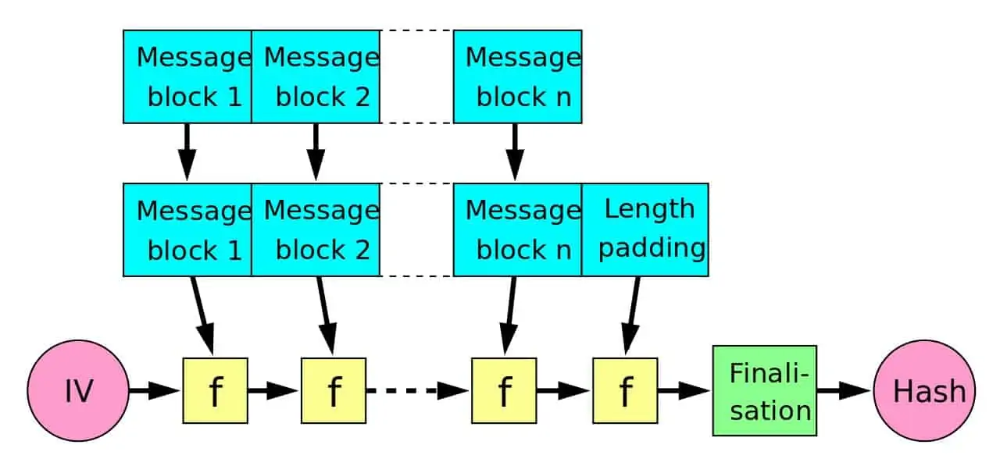
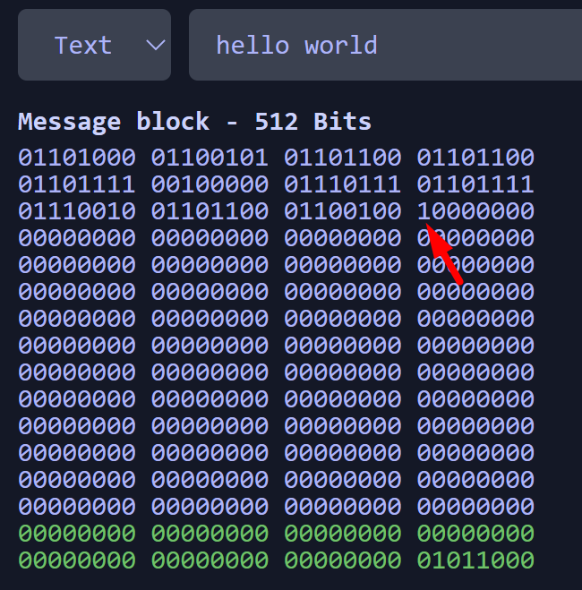
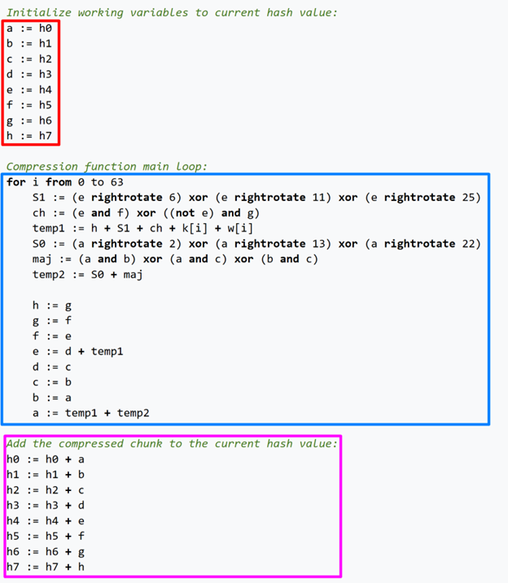
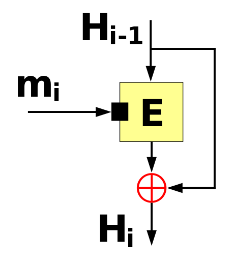

# Everything SHA-2

## What is SHA-2

SHA-2 stands for **Secure Hashing Algorithm 2**.

SHA-2 is a family of hashing algorithms designed and published by the **National Security Agency (NSA)** in 2001. 

SHA-2's predecessor was **SHA-1**. It is discouraged to use SHA-1 as it is no longer considered secure. SHA-2 is meant to be its successor. 

SHA-2 consists of many SHA algorithms. These are formally designated by the NSA.

- SHA256
- SHA224
- SHA512
- SHA384
- SHA512/256
- SHA512/224

Some hashing algorithms use SHA-2 as part of its hashing. Notable ones are the crypt implementation of SHA256 and SHA512 used to hash passwords on linux. See [here](https://www.akkadia.org/drepper/SHA-crypt.txt) for more details and implementation. *(Its complicated!)*

SHA-2 has a lot of applications. Some are listed below:

- Secure shell protocol (SSH)
- Transport Layer Security (TLS) *Used in HTTPS and email among other things*
- Used within the US government

SHA-2 algorithms are still considered secure.

## Properties of a Hashing Algorithm

> A hash algorithm takes a variable length input and outputs a fixed length output.

There are some crucial properties that makes a hash function good:

- **One-way function**: You cannot determine the input from the output.
- **Deterministic**: The same input always yields the same output.
- **Slight changes sigificantly changes output**
- **Collision resistant**: It is difficult to find two inputs that yield the same output.

Collisions are unavoidable because there are an infinite inputs and finite outputs (**Pidgeonhole Principle**). Hash algorithms with larger size of outputs will have lower change of a collision.

> There is an upper bound on collision resistance due to the **Birthday Paradox**. That upper bound is 2N/2.

## How does SHA-2 Work?

The SHA-2 algorithms differ from each other in small ways *(Different constants here and there. You get the idea)*. We will look at the broad strokes of the hashing algorithm and introduce the major parts of the algorithm.

SHA-2 works like a block cipher. It breaks the input into blocks which are fed into the compression function (represented by *f* below) to produce intermediate hashes or the final hash.

### Preprocessing

Because SHA-2 uses blocks of a fixed size, we need to do some preprocessing to the input to ensure that the input is a multiple of the block size. 

SHA-2's preprocessing goes as follows for *n* bit message *MSG*.

- Append 1 bit to the end of *MSG*
- Put *n* in big endian at the end of the last block
- Between the appended 1 bit and the *n* at the end, fill with zeros.

**Why do we append the size of the message at the end of the block?**

The size of the message is appended at the end of the block because it makes the algorithm more collision resistant. 

This process is called **length padding** or **Merkle-Damgard strengthening**.

As long as the underlying compression function is secure from collisions (it generally is for SHA-2), this process guarantees that any collision that occurs is due to a collision occuring in the underlying compression function. 

*This was proven by Merkel and Damgard independently, and we do not go into the math involved to prove it here.*

### Davies-Meyer Compression Function

Here is the pseudocode for the compression function involved in SHA256. This compression function is done for every chunk. 

This compression function is shown in the blue box and it modifies a copy of the hash value computed after the previous block. In the image above, `h0` to `h7` are 8 32-bit unsigned integers which when combined creates the 256-bit hash. 

The compression algorithm seems complicated, but it basically calculates intermediate values `temp1` and `temp2`. These intermediate values are used to modify the hash values. This is done 64 times in this algorithm.

The final result is that the data gets completely scrambled and unrecognizable from the original. Also, a single change in the input will greatly modify the final result as the change is magnified through the 64 iterations. This is called the **avalanche effect**.

Once the compression function is completed, it is added to the previous hash values to generate the next hash value. This process is called **Davies-Meyer Compression Function**.

The red box in the pseudocode aligns with Hi - 1. The blue box aligns with the E block accepting Hi - 1. The output of the E block is "xor"ed (in this case, we are using modular addition) with Hi - 1 to produce the next hash value. 

In this case, a change in the earlier chunks will have a magnifying effect on later chunks. 

**What is `k` and `w`?**

`k` is an array of constants. This array of constants can be essentially simplified as an array of constants that seem randomized.

`w` is another array of constants. It contains the data in a block along with shuffled data generated from the block. Again, the avalanche effect is utilized in generating the shuffled data.

### Putting it all together