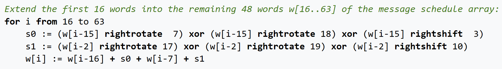
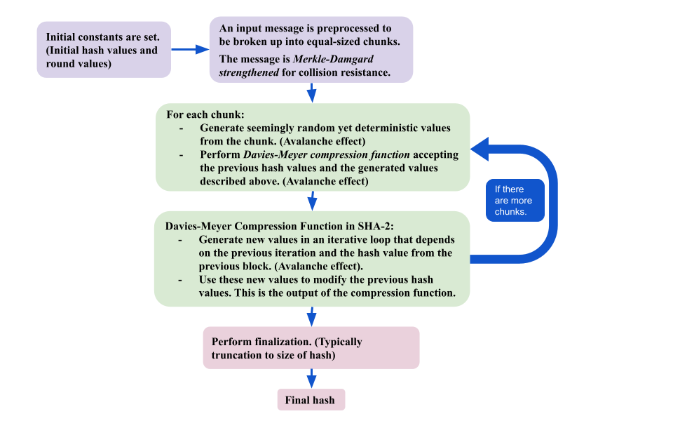

# **Everything SHA-2**

## **What is SHA-2**

SHA-2 stands for **Secure Hashing Algorithm 2**.

SHA-2 is a family of hashing algorithms designed and published by the **National Security Agency (NSA)** in 2001. 

SHA-2's predecessor was **SHA-1**. It is discouraged to use SHA-1 as it is no longer considered secure. SHA-2 is its successor. 

SHA-2 consists of many SHA algorithms. These are formally designated by the NSA.

- SHA256
- SHA224
- SHA512
- SHA384
- SHA512/256
- SHA512/224

Some hashing algorithms use SHA-2 as part of its hashing. Notable ones are the crypt implementation of SHA256 and SHA512 used to hash passwords on linux. See [here](https://www.akkadia.org/drepper/SHA-crypt.txt) for more details and implementation. *(Its complicated!)*

SHA-2 has a lot of applications. Some are listed below:

- Secure shell protocol (SSH)
- Transport Layer Security (TLS) *Used in HTTPS and email among other things*
- Used within the US government

SHA-2 algorithms are still considered secure.

## **Properties of a Hashing Algorithm**

There are some crucial properties that makes a hash function good:

- **One-way function**: You cannot determine the input from the output.
- **Deterministic**: The same input always yields the same output.
- **Slight changes sigificantly changes output**
- **Collision resistant**: It is difficult to find two inputs that yield the same output.

> A hash algorithm takes a variable length input and outputs a fixed length output.

Collisions are unavoidable because there are an infinite inputs and finite outputs (**Pidgeonhole Principle**). Hash algorithms with larger size of outputs will have lower change of a collision.

> There is an upper bound on collision resistance due to the [**Birthday Paradox**](https://en.wikipedia.org/wiki/Birthday_problem). That upper bound is 2N/2 where N is the bit length of the hash.

## **How does SHA-2 Work?**

The SHA-2 algorithms differ from each other in small ways *(Different constants here and there. You get the idea)*. The main difference between the SHA algorithms is the bit-length of the output hash. This is specified in the name of the SHA algorithm (e.g, SHA256 is 256 bits long, SHA512 is 512 bits long, etc.). For the SHA512/*t* algorithms, *t* is the bit-length of the hash. 

We will look at the broad strokes of the hashing algorithm and introduce the major parts of the algorithm.

SHA-2 works like a block cipher. It breaks the input into fixed-size blocks which are fed into the compression function represented by *f* below. This compression function outputs a hash which may be used as the input for the next block if needed.

### **Preprocessing**

Because SHA-2 uses blocks of a fixed size, we need to do some preprocessing to the input to ensure that the input is a multiple of the block size. 

SHA-2's preprocessing goes as follows for *n* bit message *MSG*.

- Append 1 bit to the end of *MSG*
- Put *n* in big endian at the end of the last block
- Between the appended 1 bit and the *n* at the end, fill with zeros.

**Why do we append the size of the message at the end of the block?**

The size of the message is appended at the end of the block because it makes the algorithm more collision resistant. 

This process is called **length padding** or [**Merkle-Damgard strengthening**](https://en.wikipedia.org/wiki/Merkle%E2%80%93Damg%C3%A5rd_construction).

As long as the underlying compression function is secure from collisions, this process guarantees that any collision that occurs is due to a collision occuring in the underlying compression function. Basically, it makes SHA more collision resistant.

*This was proven by Merkel and Damgard independently. There is math involved with the proof. If you are curious, you can look up the proof.*

### **Davies-Meyer Compression Function**

Before we perform the compression function on the blocks, we decompose the blocks into 16 equal-equal sized **words**. These 16 words are used to generate more words which will be used in the compression function. 

The pseudocode for generating these values in SHA256 are found below:

Noteworthy parts of the pseudocode above:

- The bitwise right rotate, xor, and right shifts essentially scramble the values so that it appears random (still deterministic).
- The words generated depends on previous words.

Because the words depends on the previous words, small changes in one part of the block will have propagating effect on the rest of the words. This effect is called the **Avalanche Effect**, and it is desireable for hash functions.

Avalanche Effect (Snowball) 

The SHA-2 algorithms also have an array of constant values. These values also appear random. For example, SHA256 defines these constants as the first 32 bits of the fractional part (also called the *mantissa*) of the cube root of the first 64 primes. This is stored in the array `k` in the pseudocode.

Likewise, the SHA-2 algorithms has an initial hash value (*Initialization Values*). These values are defined similarly as above with some slight variation.

Here is the pseudocode for the compression function involved in SHA256. This compression function is done for every chunk. 

Looking at the pseudocode, we can see in the red box that our input is the previous block's output hash. The output, seen in the magenta box, is the new hash value. Another input as seen in the blue box is the word message schedule array `w`.

This process of the function accepting two arguments, the previous output and a new input, to produce a new output is called the **[Davies-Meyer Compression Function](https://en.wikipedia.org/wiki/One-way_compression_function#Davies%E2%80%93Meyer)**.

The red box in the pseudocode aligns with Hi-1. The blue box aligns with the E block accepting Hi-1. The output of the E block is "xor"ed with Hi-1 to produce the next hash value as seen in the magenta box. As a result, because the output hash depends on the previous hash output (intermediate hash), the avalanche effect occurs between chunks. 

SHA256 Compression Pseudocode

This compression function is shown in the blue box and it modifies a copy of the hash value computed after the previous block. In the image above, `h0` to `h7` are eight 32-bit unsigned integers which when combined creates the 256-bit hash. 

The compression algorithm seems complicated, but it basically calculates intermediate values `temp1` and `temp2`. These intermediate values are used to modify the hash values. This is done 64 times in this algorithm.

Noteworthy parts of the compression function:

- It uses `w[i]` which was generated previously and is susceptible to the avalanche effect.
- The function modifies the `a`, `b`, etc using its own value each iteration. 

The result is another avalanche effect. A single change will accumulate and completely modify all the values by the end of the loop. The final result is completely scrambled and unrecognizable from the original. 

Also again, a single change in the input hash will evidently greatly modify the final result as the change is magnified. 

Once the compression function is completed, it is added to the previous hash values to generate the next hash value (magenta box).  

This process continues for every chunk. Finally, the final hash values are passed through the finalization stages (usually a truncation to the appropriate bit length) and the result is the final hash value.

## **Summary**

## **Additional Resources**

- https://sha256algorithm.com/ 
  - Helpful visualizer for SHA256 algorithm